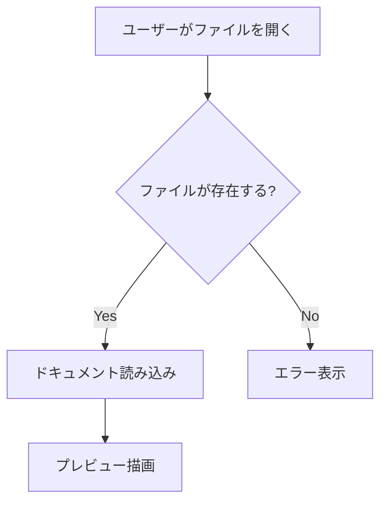
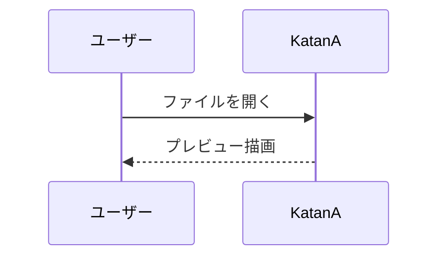
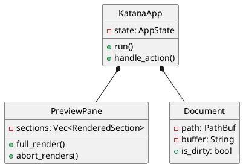

# KatanA — 描画機能デモ

このドキュメントは KatanA で利用可能なすべての描画機能を紹介します。
エディタと並べて開き、各要素がどのように描画されるかを確認してください。

<p align="center">
  <a href="Katana://Command/SwitchDemoLanguage?lang=en">English</a> | 日本語
</p>

---

## 1. テキスト書式

**太字**、*イタリック*、~~取り消し線~~、<u>下線</u>、`インラインコード`、<mark>ハイライト</mark>

組み合わせ: **太字の中に *イタリック* を含む**

---

## 2. 見出し（H1〜H6）

# H1 — 最上位見出し
## H2 — セクション見出し
### H3 — サブセクション
#### H4 — 詳細
##### H5 — 小見出し
###### H6 — 最小見出し

---

## 3. リンク

- [GitHub](https://github.com) — 外部リンク
- [メール](mailto:hello@example.com) — mailto リンク
- 自動検出: https://github.com

---

## 4. リスト

### 番号なしリスト

- アルファ
- ベータ
  - ベータ-1
  - ベータ-2
    - ベータ-2-a
- ガンマ

### 番号付きリスト

1. 最初
2. 2番目
   1. サブ-2-A
   2. サブ-2-B
3. 3番目

### タスクリスト

- [x] Markdown 描画の実装
- [x] ダイアグラムサポートの追加
- [ ] AI アシスタントの追加
- [-] 実験的機能（進行中）
- [/] 別の進行中項目

---

## 5. テーブル

### 基本テーブル

| 言語 | 状態 | 追加バージョン |
|----------|--------|-------|
| 英語 | ✅ 安定 | v0.1.0 |
| 日本語 | ✅ 安定 | v0.5.0 |
| 中国語 | ✅ 安定 | v0.8.0 |
| 韓国語 | ✅ 安定 | v0.9.0 |

### 整列テーブル

| 左寄せ | 中央 | 右寄せ |
|:-----|:------:|------:|
| テキスト | テキスト | 1 |
| 長いテキスト | 短い | 12345 |

---

## 6. 引用

> シンプルな引用ブロック。

> ネスト:
> > 内側のレベル
> > > さらに深く

> **書式付き引用**
>
> - 項目1
> - 項目2

---

## 7. Note ブロック（旧形式）

> **Note**
> これは旧形式の Note ブロックです。

> **Warning**
> これは Warning ブロックです。

---

## 8. アラートブロック（GFM形式）

> [!NOTE]
> 読者への追加情報です。

> [!TIP]
> 役立つヒントです。

> [!IMPORTANT]
> 重要な情報です。

> [!WARNING]
> 潜在的なリスクがあります。

> [!CAUTION]
> 高リスクの操作に対する警告です。

---

## 9. コードブロック

### Rust

```rust
fn main() {
    println!("KatanA からこんにちは！");
}
```

### Python

```python
def greet(name: str) -> str:
    return f"こんにちは、{name}さん！"
```

### JSON

```json
{
  "name": "KatanA",
  "version": "0.16.10",
  "features": ["markdown", "diagrams", "reference-mode"]
}
```

---

## 10. 数式

### ブロック数式

```math
E = mc^2
```

### インライン数式

アインシュタインの有名な方程式: $E = mc^2$

### ディスプレイ数式

$$ \int_{-\infty}^{\infty} e^{-x^2} dx = \sqrt{\pi} $$

---

## 11. ダイアグラム

### Mermaid — フローチャート



### Mermaid — シーケンス図



### DrawIo

```drawio
<mxGraphModel>
  <root>
    <mxCell id="0"/>
    <mxCell id="1" parent="0"/>
    <mxCell id="2" value="KatanA" style="rounded=1;fillColor=#dae8fc;strokeColor=#6c8ebf;" vertex="1" parent="1">
      <mxGeometry x="50" y="30" width="120" height="60" as="geometry"/>
    </mxCell>
  </root>
</mxGraphModel>
```

### PlantUML — クラス図



---

## 12. アコーディオン

<details><summary>クリックして展開</summary><div>

クリックで表示される隠しコンテンツ。オプションの詳細や補足情報に便利。

- 項目 A
- 項目 B
- 項目 C

</div></details>

---

## 13. 脚注

この文には脚注[^1]があり、もう一つ[^2]もあります。

[^1]: 最初の脚注の内容。
[^2]: 2番目の脚注の内容。

---

## ✅ デモ終了

KatanA の全描画機能を確認しました。
このタブを閉じる（{{os_cmd:close_tab}}）か、自分の Markdown ファイルで探索を続けてください。
