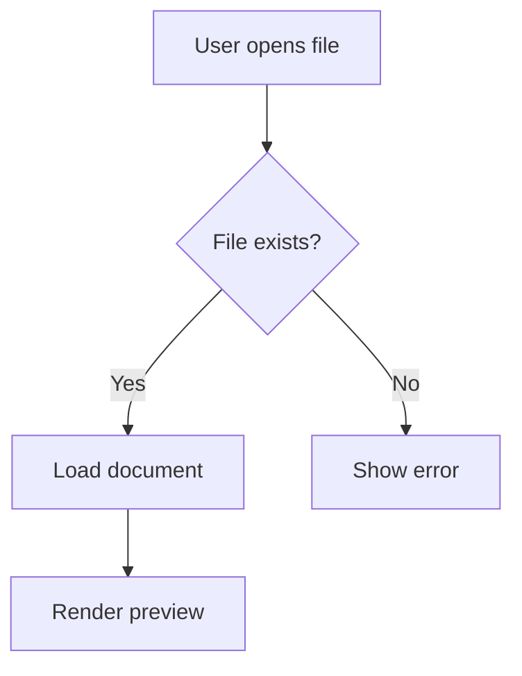
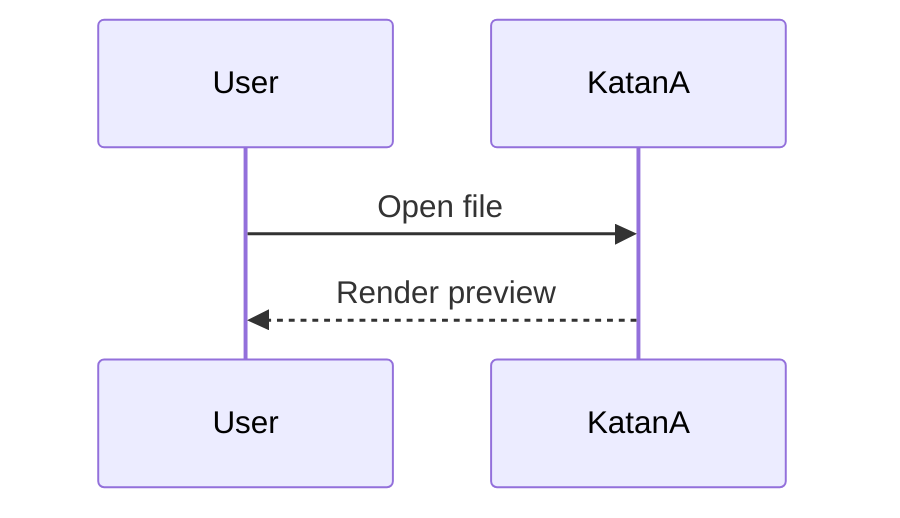
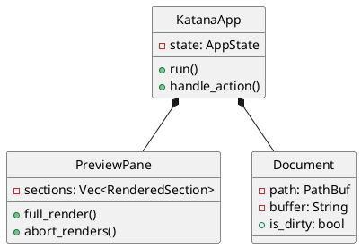

# KatanA — Rendering Features

This document demonstrates every rendering feature available in KatanA.
Open it alongside the editor to see how each element is rendered.

<p align="center">
  English | <a href="rendering_features.ja.md">日本語</a>
</p>

---

## 1. Text Formatting

**Bold**, *italic*, ~~strikethrough~~, <u>underline</u>, `inline code`, and <mark>highlight</mark>.

Combined: **bold with *nested italic* inside**.

---

## 2. Headings (H1–H6)

# H1 — Top-level heading
## H2 — Section heading
### H3 — Subsection
#### H4 — Detail
##### H5 — Minor detail
###### H6 — Finest level

---

## 3. Links and Images

- [GitHub](https://github.com) — external link
- [Email](mailto:hello@example.com) — mailto link
- Auto-detected: https://github.com

---

## 4. Lists

### Unordered

- Alpha
- Beta
  - Beta-1
  - Beta-2
    - Beta-2-a
- Gamma

### Ordered

1. First
2. Second
   1. Sub-second-A
   2. Sub-second-B
3. Third

### Task List

- [x] Implement Markdown rendering
- [x] Add diagram support
- [ ] Add AI assistant
- [-] Experimental feature (in-progress)
- [/] Another in-progress item

---

## 5. Tables

### Basic Table

| Language | Status | Since |
|----------|--------|-------|
| English | ✅ Stable | v0.1.0 |
| Japanese | ✅ Stable | v0.5.0 |
| Chinese | ✅ Stable | v0.8.0 |
| Korean | ✅ Stable | v0.9.0 |

### Aligned Table

| Left | Center | Right |
|:-----|:------:|------:|
| text | text | 1 |
| longer text | short | 12345 |

---

## 6. Blockquotes

> A simple blockquote.

> Nested:
> > Inner level
> > > Even deeper

> **Strong quote with formatting**
>
> - Item one
> - Item two

---

## 7. Note Blocks (Legacy)

> **Note**
> This is a note block in the legacy format.

> **Warning**
> This is a warning block.

---

## 8. Alert Blocks (GFM)

> [!NOTE]
> Informational note for the reader.

> [!TIP]
> A helpful tip.

> [!IMPORTANT]
> Critical information.

> [!WARNING]
> Potential risk.

> [!CAUTION]
> High-risk action warning.

---

## 9. Code Blocks

### Rust

```rust
fn main() {
    println!("Hello from KatanA!");
}
```

### Python

```python
def greet(name: str) -> str:
    return f"Hello, {name}!"
```

### JSON

```json
{
  "name": "KatanA",
  "version": "0.16.10",
  "features": ["markdown", "diagrams", "reference-mode"]
}
```

---

## 10. Math

### Block Math

```math
E = mc^2
```

### Inline Math

Einstein's famous equation: $E = mc^2$

### Display Math

$$ \int_{-\infty}^{\infty} e^{-x^2} dx = \sqrt{\pi} $$

---

## 11. Diagrams

### Mermaid — Flowchart



### Mermaid — Sequence



### DrawIo

```drawio
<mxGraphModel>
  <root>
    <mxCell id="0"/>
    <mxCell id="1" parent="0"/>
    <mxCell id="2" value="KatanA" style="rounded=1;fillColor=#dae8fc;strokeColor=#6c8ebf;" vertex="1" parent="1">
      <mxGeometry x="50" y="30" width="120" height="60" as="geometry"/>
    </mxCell>
  </root>
</mxGraphModel>
```

### PlantUML — Class Diagram



---

## 12. Accordion

<details><summary>Click to expand</summary><div>

Hidden content revealed on click. Useful for optional details or spoilers.

- Item A
- Item B
- Item C

</div></details>

---

## 13. Footnotes

This sentence has a footnote[^1] and another one[^2].

[^1]: First footnote content.
[^2]: Second footnote content.

---

## ✅ End of Demo

You have seen the full rendering capabilities of KatanA.
Close this tab (⌘W) or explore more with your own Markdown files.
