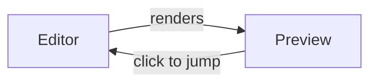

# KatanA — Feature Walkthrough

Welcome to **KatanA**, a fast, lightweight Markdown workspace for macOS built
with Rust and egui.

  English | <a href="welcome.ja.md">日本語</a>

---

## What You Are Looking At

This tab is part of the **Demo bundle** — a curated set of files opened by
**Help → Demo** so you can explore KatanA's capabilities without leaving the
application.

The files in this demo group are:

| File | Purpose |
|------|---------|
| `welcome.md` | This introduction (Markdown, editable) |
| `rendering_features.md` | Full rendering showcase |
| `katana_config.toml` | Example configuration (reference, read-only) |
| `sample_code.rs` | Example Rust code (reference, read-only) |

> [!TIP]
> Code and configuration files in this demo open in **reference mode** — they
> are read-only so you can inspect them safely without accidentally modifying
> the bundled assets.

---

## Core Features at a Glance

### ✍️ Markdown Editing

KatanA renders GitHub-Flavored Markdown in real time. Open
`rendering_features.md` in this group to see headings, lists, tables,
blockquotes, task lists, math, and more.

### 🖼️ Diagram Support

Paste a Mermaid, PlantUML, or DrawIo fenced code block and KatanA renders it
automatically in the preview pane — no browser required.

### 🗂️ Tab Groups

Every file in this demo belongs to the **demo** tab group. You can create your
own groups by right-clicking any tab.

### 🌐 Localization

KatanA is available in English, Japanese, Chinese (Simplified & Traditional),
Korean, Portuguese, French, German, Spanish, and Italian. Change the language
under **KatanA → Language**.

---

## Getting Started with Your Own Workspace

1. Choose **File → Open Workspace** (⌘O) to open a folder.
2. Navigate files using the sidebar on the left.
3. KatanA auto-saves your tab layout and scroll position between sessions.

---

## Reference Files in This Bundle

For a hands-on look at KatanA's configuration format, open
`katana_config.toml` from the demo tab group. For a code example rendered
with syntax highlighting, open `sample_code.rs`.

Both files open in **reference mode** and cannot be edited — this protects
the demo bundle from accidental changes.

---

*Close this tab or press ⌘W to dismiss it.*
