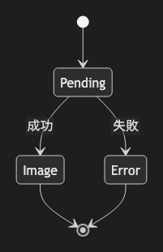

# 04. State Diagram

~~~mermaid
stateDiagram-v2
    [*] --> Pending
    Pending --> Image : 成功
    Pending --> Error : 失敗
    Image --> [*]
    Error --> [*]
~~~

<!-- katana-mermaid-official:start -->

## 公式Mermaid.js描画

<!-- katana-mermaid-official:end -->
