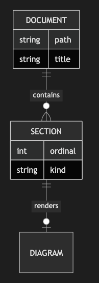

# 05. Entity Relationship Diagram

~~~mermaid
erDiagram
    DOCUMENT ||--o{ SECTION : contains
    SECTION ||--o| DIAGRAM : renders
    DOCUMENT {
        string path
        string title
    }
    SECTION {
        int ordinal
        string kind
    }
~~~

<!-- katana-mermaid-official:start -->

## 公式Mermaid.js描画

<!-- katana-mermaid-official:end -->
