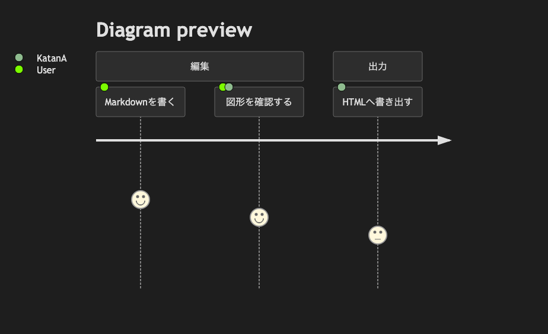

# 06. User Journey

~~~mermaid
journey
    title Diagram preview
    section 編集
      Markdownを書く: 5: User
      図形を確認する: 4: User, KatanA
    section 出力
      HTMLへ書き出す: 3: KatanA
~~~

<!-- katana-mermaid-official:start -->

## 公式Mermaid.js描画

<!-- katana-mermaid-official:end -->
