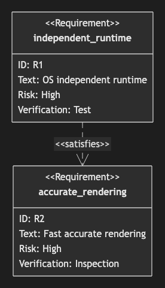

# 09. Requirement Diagram

~~~mermaid
requirementDiagram
    requirement independent_runtime {
        id: R1
        text: OS independent runtime
        risk: high
        verifymethod: test
    }
    requirement accurate_rendering {
        id: R2
        text: Fast accurate rendering
        risk: high
        verifymethod: inspection
    }
    independent_runtime - satisfies -> accurate_rendering
~~~

<!-- katana-mermaid-official:start -->

## 公式Mermaid.js描画

<!-- katana-mermaid-official:end -->
