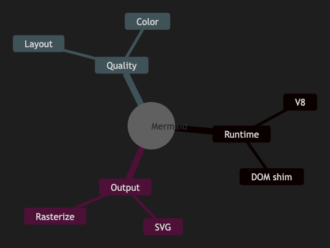

# 12. Mindmap

~~~mermaid
mindmap
  root((Mermaid))
    Runtime
      V8
      DOM shim
    Output
      SVG
      Rasterize
    Quality
      Layout
      Color
~~~

<!-- katana-mermaid-official:start -->

## 公式Mermaid.js描画

<!-- katana-mermaid-official:end -->
