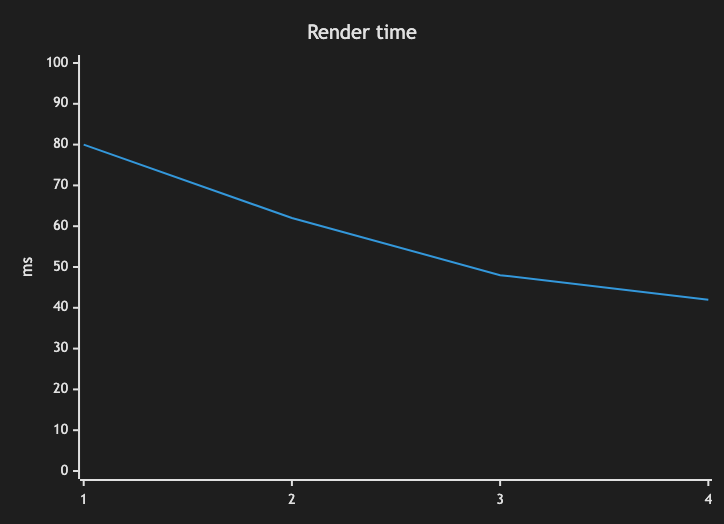

# 15. XY Chart

~~~mermaid
xychart-beta
    title "Render time"
    x-axis [1, 2, 3, 4]
    y-axis "ms" 0 --> 100
    line [80, 62, 48, 42]
~~~

<!-- katana-mermaid-official:start -->

## 公式Mermaid.js描画

<!-- katana-mermaid-official:end -->
