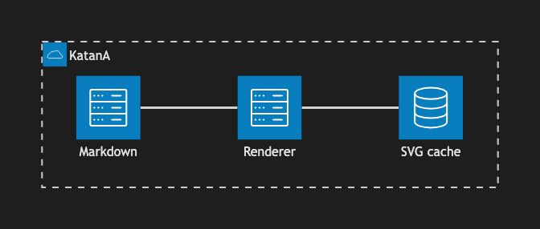

# 20. Architecture Diagram

~~~mermaid
architecture-beta
    group app(cloud)[KatanA]
    service markdown(server)[Markdown] in app
    service renderer(server)[Renderer] in app
    service svg(database)[SVG cache] in app
    markdown:R -- L:renderer
    renderer:R -- L:svg
~~~

<!-- katana-mermaid-official:start -->

## 公式Mermaid.js描画

<!-- katana-mermaid-official:end -->
