# Mermaid 全パターン確認用

この fixture は、KatanA が読み込む `mermaid.min.js` で検出される Mermaid 図形種別をまとめて確認するためのもの。

---

## 1. Flowchart / Graph

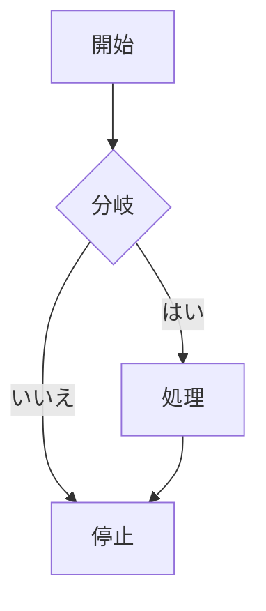

## 2. Sequence Diagram

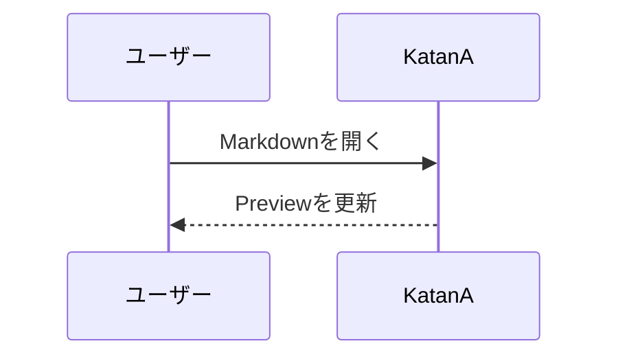

## 3. Class Diagram

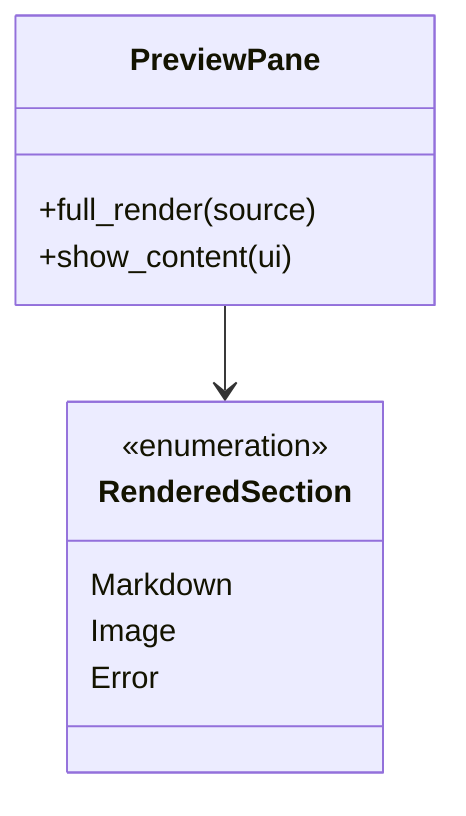

## 4. State Diagram

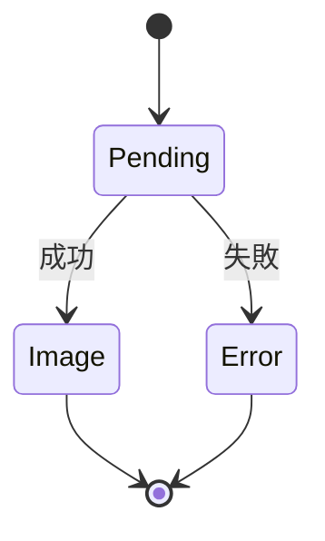

## 5. Entity Relationship Diagram

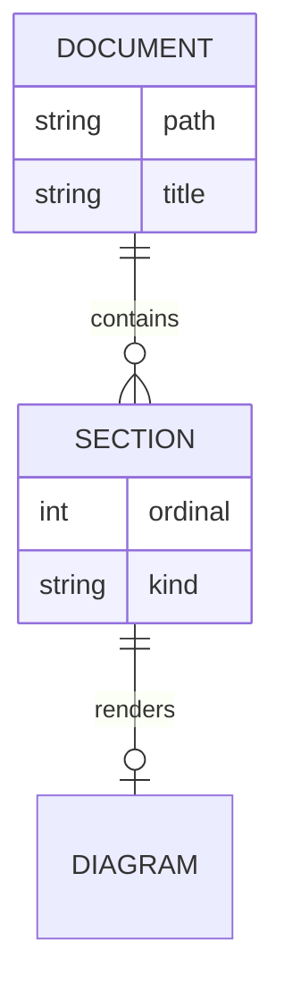

## 6. User Journey

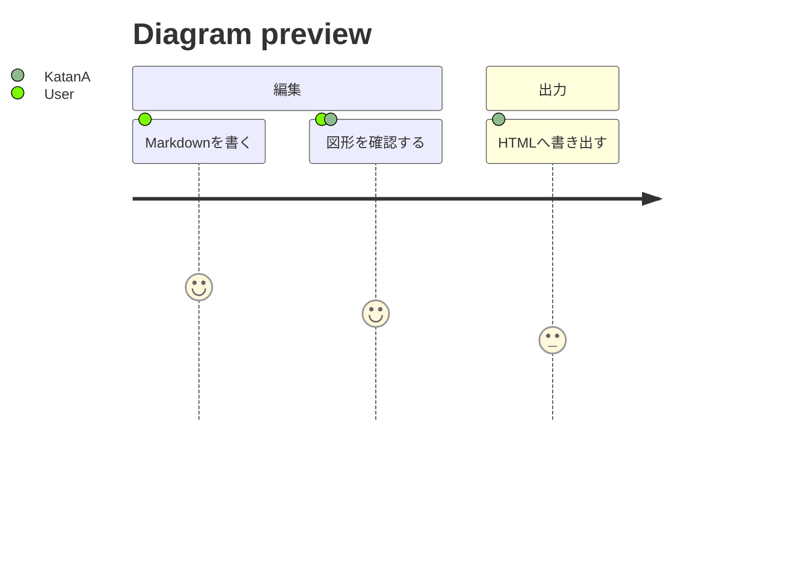

## 7. Gantt Chart

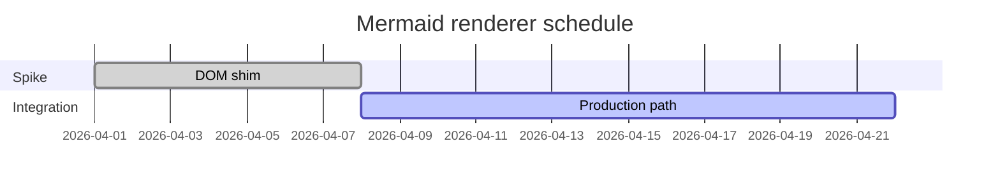

## 8. Pie Chart

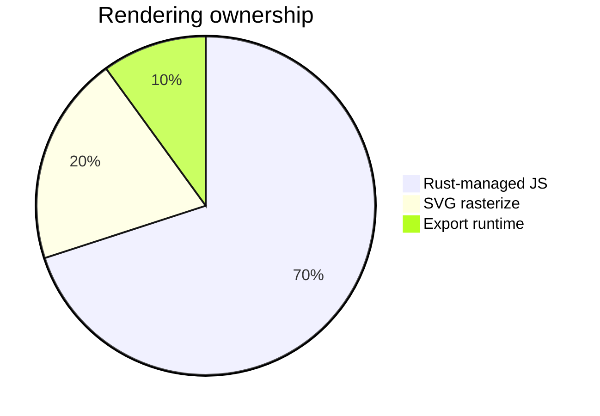

## 9. Requirement Diagram

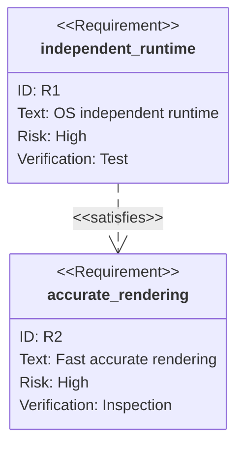

## 10. Git Graph

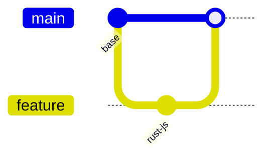

## 11. C4 Diagram

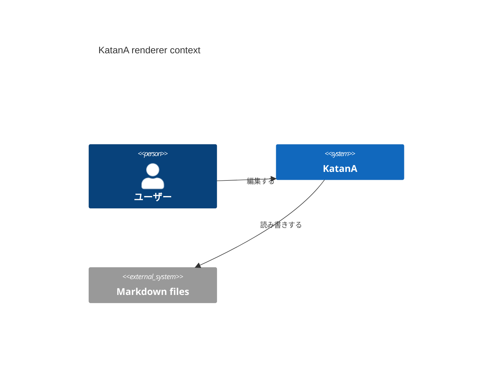

## 12. Mindmap

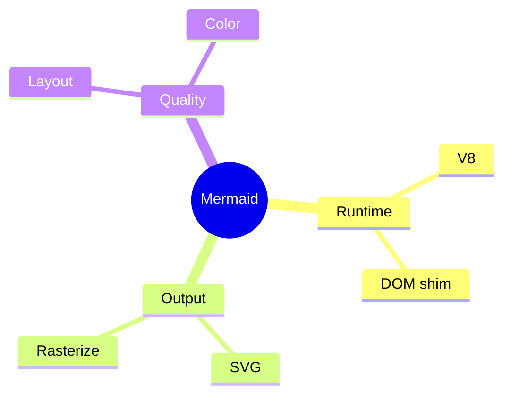

## 13. Timeline

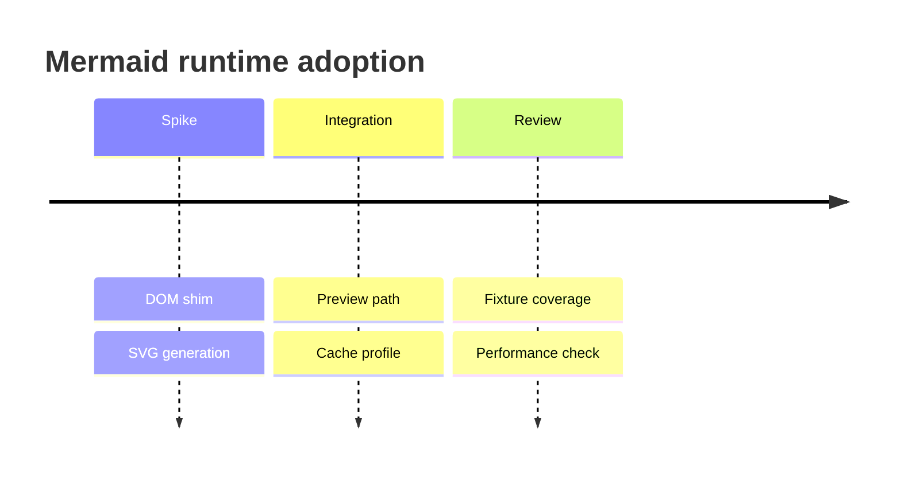

## 14. Quadrant Chart

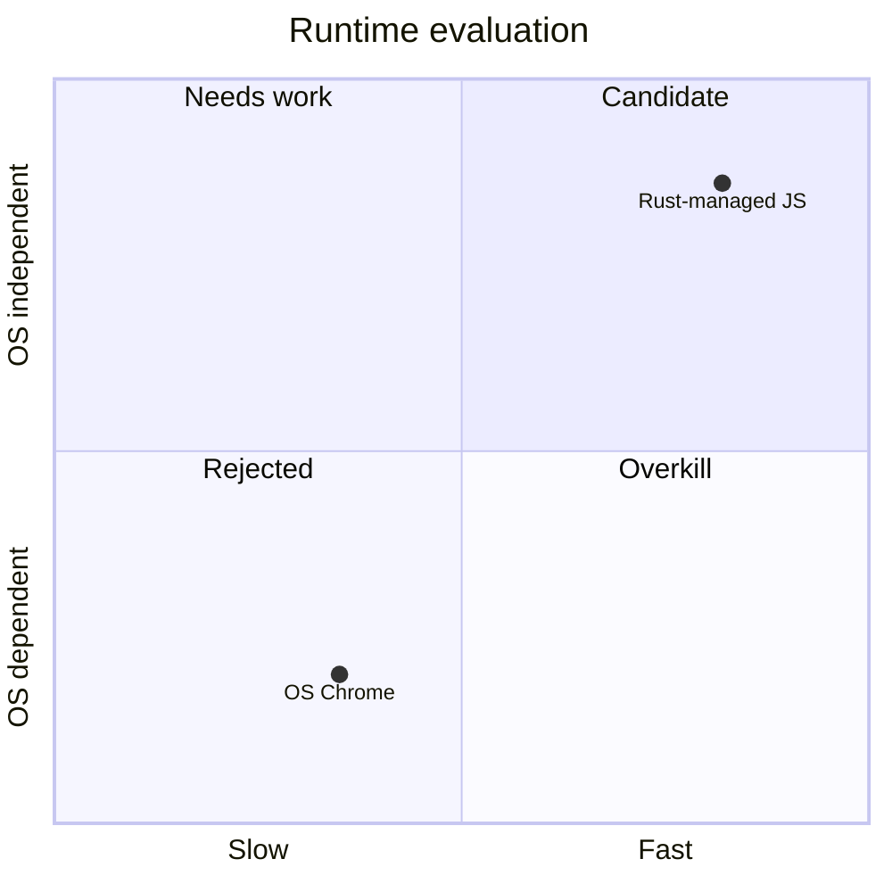

## 15. XY Chart

```mermaid
xychart-beta
    title "Render time"
    x-axis [1, 2, 3, 4]
    y-axis "ms" 0 --> 100
    line [80, 62, 48, 42]
```

## 16. Sankey

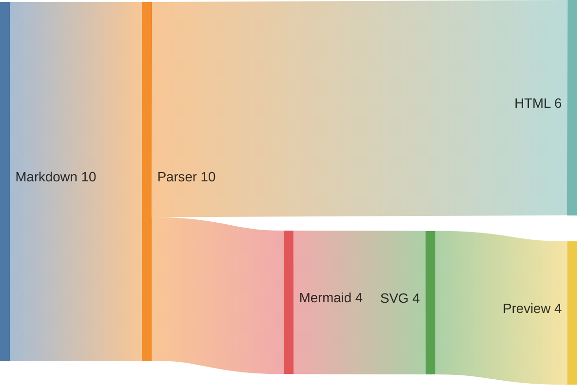

## 17. Block Diagram

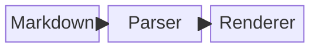

## 18. Packet Diagram

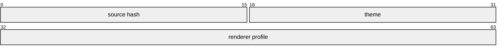

## 19. Kanban

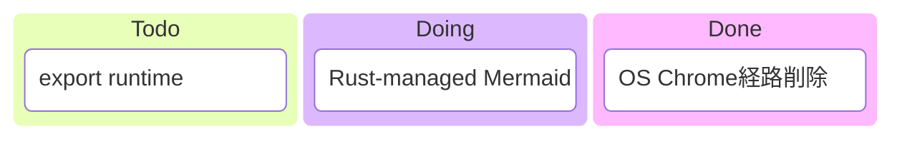

## 20. Architecture Diagram

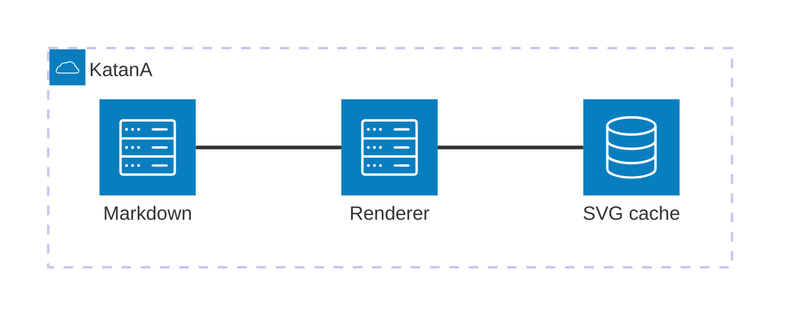

## 21. Radar Chart

```mermaid
radar-beta
    title Mermaid runtime
    axis Speed, Accuracy, Portability, Maintainability
    curve Current {4, 4, 5, 3}
    curve Target {5, 5, 5, 4}
    max 5
```

## 22. Tree View

```mermaid
treeView-beta
    "Root"
        "Runtime"
            "V8"
            "DOM shim"
        "Output"
            "SVG"
            "Rasterize"
```

## 23. Ishikawa Diagram

```mermaid
ishikawa-beta
  Diagram quality
    Runtime
      DOM API
      SVG API
    Layout
      Text measurement
      ViewBox
    Color
      Theme
      Background
```

## 24. Venn Diagram

```mermaid
venn-beta
    title Renderer scope
    set official ["Official Mermaid.js"]: 40
    set rust ["Rust-managed runtime"]: 35
    union official, rust: 25
```

## 25. Treemap

```mermaid
treemap
    title Runtime cost
    "Mermaid" : 45
    "DOM shim" : 25
    "Rasterize" : 20
    "Cache" : 10
```

## 26. Wardley Map

```mermaid
wardley-beta
    title Renderer adoption
    anchor User [0.95, 0.62]
    component Preview [0.78, 0.55]
    component MermaidJS [0.62, 0.42]
    component DOMShim [0.38, 0.35]
    User->Preview
    Preview->MermaidJS
    MermaidJS->DOMShim
```
