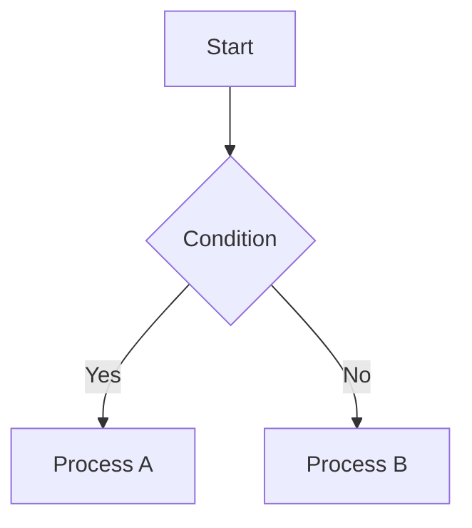

# KatanA User Guide

**KatanA** is a fast and lightweight Markdown workspace for macOS.
This guide explains the core features and interactions.

---

## Getting Started

### Open a Workspace

Go to **File → Open Workspace...** or press `{{os_cmd:open_workspace}}` to select a folder containing Markdown files.
KatanA will index all `.md` files and display them in the Explorer sidebar.

### Open a File

Click a filename in the Explorer, or use the Command Palette (`{{os_cmd:open_palette}}`) to search for files.

---

## Keyboard Shortcuts

| Shortcut | Action |
| --- | --- |
| `{{os_cmd:open_palette}}` | Open Command Palette |
| `{{os_cmd:search_tab}}` | Text Search |
| `{{os_cmd:toggle_sidebar}}` | Toggle Sidebar |
| `{{os_cmd:save_document}}` | Save File |
| `{{os_cmd:refresh_preview}}` | Refresh Preview |
| `{{os_cmd:close_tab}}` | Close Tab |
| `{{os_cmd:undo}}` | Undo |
| `{{os_cmd:redo}}` | Redo |
| `{{os_cmd:toggle_comment}}` | Toggle Comment |

---

## Tabs and Document Management

### Tab Bar

Open files are displayed as tabs at the top of the window.

- **Click a tab** → Switch between files.
- **Right-click a tab** → Context menu (Close, Pin, Add to Group, etc.).
- **Drag a tab** → Reorder tabs.
- **Pin** (📌): Fix a tab to prevent accidental closing.
- **Restore recently closed tabs**: Use the `◀` button at the right end of the tab bar.

### Tab Groups

You can manage multiple files as a group. Right-click a file in the explorer and select "Create Tab Group" or "Add to Existing Group".

---

## View Modes

You can switch between view modes using the buttons at the top right of the editor.

| Mode | Description |
| --- | --- |
| **Preview** | Shows only the rendered Markdown. |
| **Code** | Shows only the raw Markdown source (Editor). |
| **Split** | Shows both the Editor on the left and Preview on the right. |

In Split mode, you can toggle scroll synchronization on or off.

---

## Command Palette

Press `{{os_cmd:open_palette}}` to open the Command Palette. You can search for both filenames and commands.

- Type a filename → Open the file.
- Start with `>` → Execute a command (e.g., `> Export`).

---

## Sidebar

Switch panels using the icons on the left edge.

| Icon | Panel |
| --- | --- |
| 📁 | **Explorer** — File tree within the workspace. |
| 🔍 | **Search** — Full-text search across all files. |
| 🕐 | **History** — List of recently opened files. |
| ❓ | **Help** — This guide and release notes. |

### Explorer Operations

- **Right-click a file** → Open / Rename / Delete / Reveal in Finder / Copy Path / Add to Tab Group.
- **Right-click a folder** → New File / New Folder / Expand All / Open All Files.

---

## Document Information

To view detailed information for each file, right-click the file in the explorer and select **"Show Meta Info"**.

Information displayed:

- **General**: Filename, path, type.
- **File System**: File size, modified date, created date, owner, permissions.
- **Status**: Unsaved changes, loaded status, pinned status.

---

## Markdown Syntax

KatanA supports [CommonMark](https://commonmark.org) compliant Markdown.

### Basic Syntax

```markdown
# Heading 1
## Heading 2

**Bold** / *Italic* / ~~Strikethrough~~

[Link Text](https://example.com)


```

### Code Blocks

````markdown
```rust
fn main() {
    println!("Hello, KatanA!");
}
```
````

Specifying the language name enables syntax highlighting.

### Tables

```markdown
| Col 1 | Col 2 | Col 3 |
|---|---|---|
| A | B | C |
```

### Task Lists

```markdown
- [x] Completed task
- [ ] Incomplete task
```

Checklists can be toggled in the preview by clicking them.

### Math Notation (MathJax)

```markdown
Inline: $E = mc^2$

Block:
$$
\int_{-\infty}^{\infty} e^{-x^2} dx = \sqrt{\pi}
$$
```

### Diagrams (Mermaid)



Diagrams can be viewed in full screen by clicking them.

---

## Table of Contents (TOC)

Click the "TOC" button at the top of the preview to display a list of headings in the side panel. Click a heading to jump to it.

---

## Export

Export files via **Menu → File → Export**.

| Format | Description |
| --- | --- |
| HTML | Styled HTML document. |
| PDF | PDF for printing. |
| PNG | Export as a PNG image. |
| JPEG | Export as a JPEG image. |

---

## Settings

Change various settings via **Menu → File → Settings**.

- **Display Language**: Japanese, English, Chinese (Simplified/Traditional), Korean, Portuguese, French, German, Spanish, Italian.
- **Scroll Sync**: Default scroll synchronization setting for Split mode.
- **Auto Save**: Timing for automatic file saving.

---

## Update

Check for and install the latest version via **Menu → Help → Check for Updates...**.
A badge will appear at the top right of the window when a new version is available.

---

*For more details about KatanA, see the [Release Notes] (Menu → Help → Release Notes).*
