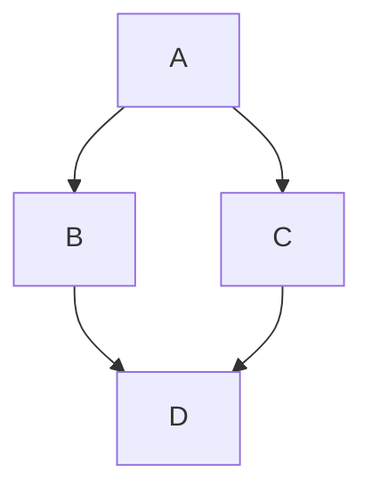

# KatanA User Guide

**KatanA** is a fast and lightweight Markdown workspace for macOS.
This guide explains the core features and interactions.

---

## Getting Started

### Open a Workspace

Go to **File → Open Workspace...** or press `⌘ O` to select a folder containing Markdown files.
KatanA will index all `.md` files and display them in the Explorer sidebar.

### Open a File

Click a filename in the Explorer, or use the Command Palette (`⌘ P`) to search for files.

---

## Keyboard Shortcuts

| Shortcut | Action |
| --- | --- |
| `⌘ P` | Open Command Palette |
| `⌘ F` | Search Files |
| `⌘ B` | Toggle Sidebar |
| `⌘ S` | Save File |
| `⌘ R` | Refresh Diagrams |
| `⌘ W` | Close Tab |

---

## Tab Management

Tabs are displayed at the top. You can pin tabs, group them, and reorder them by dragging.

---

## Meta Info

To see detailed file information (size, permissions, etc.), right-click a file in the explorer and select **"Show Meta Info"**.

---

## Diagrams (Mermaid/PlantUML/DrawIo)

Just use fenced code blocks, and KatanA will render them in the preview pane.

---

*For more details, see the Release Notes in the Help menu.*
