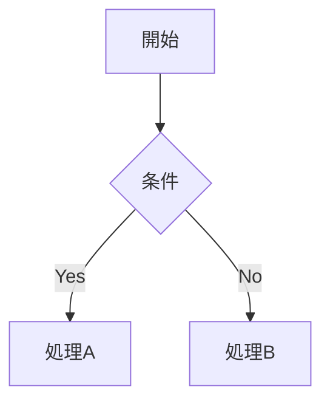

# KatanA 操作ガイド

KatanA は macOS 向けの高速・軽量な Markdown ワークスペースです。
このガイドでは主要な操作と機能を説明します。

---

## はじめに

### ワークスペースを開く

**メニュー → ファイル → ワークスペースを開く…** または {{os_cmd:open_workspace}} を押して、Markdownファイルが入ったフォルダを選んでください。
選択したフォルダ内のすべての `.md` ファイルがサイドバーのエクスプローラーに一覧表示されます。

### ファイルを開く

エクスプローラー（左サイドバー）でファイル名をクリック、またはコマンドパレット（{{os_cmd:open_palette}}）でファイル名を検索して開けます。

---

## キーボードショートカット

| ショートカット | 操作 |
| --- | --- |
| {{os_cmd:open_palette}} | コマンドパレットを開く |
| {{os_cmd:search_tab}} | テキスト検索 |
| {{os_cmd:toggle_sidebar}} | サイドバーの表示/非表示 |
| {{os_cmd:save_document}} | ファイルを保存 |
| {{os_cmd:refresh_preview}} | プレビューを更新 |
| {{os_cmd:close_tab}} | タブを閉じる |
| {{os_cmd:undo}} | 元に戻す |
| {{os_cmd:redo}} | やり直す |
| {{os_cmd:toggle_comment}} | コメントの切り替え |

---

## タブとドキュメント管理

### タブバー

開いているファイルはウィンドウ上部のタブに表示されます。

- **タブをクリック** → ファイルを切り替え
- **タブを右クリック** → コンテキストメニュー（閉じる、ピン留め、グループ追加 など）
- **タブをドラッグ** → 並び替え
- **ピン留め**（📌）: タブを固定して誤って閉じないようにする
- **最近閉じたタブの復元**: タブバー右端の `◀` ボタン

### タブグループ

複数のファイルをグループとしてまとめて管理できます。エクスプローラーからファイルを右クリックし、「タブグループを作成」または「既存グループに追加」を選択してください。

---

## 表示モード

エディタ右上のボタンで表示モードを切り替えられます。

| モード | 説明 |
| --- | --- |
| **プレビュー** | Markdown をレンダリングした結果のみ表示 |
| **コード** | 生の Markdown ソースのみ表示（エディタ） |
| **分割** | 左にエディタ、右にプレビューを同時表示 |

分割モードでは、スクロール同期のオン/オフを切り替えることができます。

---

## コマンドパレット

{{os_cmd:open_palette}} で開けます。ファイル名・コマンド名の両方を検索できます。

- ファイル名を入力 → ファイルを開く
- `>` を先頭につける → コマンドを実行（例: `> エクスポート`）

---

## サイドバー

左端のアイコンでパネルを切り替えます。

| アイコン | パネル |
| --- | --- |
| 📁 | **エクスプローラー** — ワークスペース内のファイルツリー |
| 🔍 | **検索** — 全ファイルへのテキスト検索 |
| 🕐 | **履歴** — 最近開いたファイル一覧 |
| ❓ | **ヘルプ** — このガイドとリリースノート |

### エクスプローラーの操作

- **ファイル右クリック** → ファイルを開く / 名前変更 / 削除 / Finder で表示 / パスをコピー / タブグループに追加
- **フォルダ右クリック** → 新規ファイル / フォルダ作成 / すべて展開 / すべてのファイルを開く

---

## ドキュメント情報

各ファイルの情報を確認するには、エクスプローラーでファイルを右クリックして「メタ情報を表示」を選択してください。

表示される情報：

- **全般**: ファイル名・パス・種類
- **ファイルシステム**: ファイルサイズ・更新日時・作成日時・所有者・パーミッション
- **ステータス**: 未保存の変更の有無・読み込み済み・ピン留め状態

---

## Markdown 記法

KatanA は [CommonMark](https://commonmark.org) 準拠の Markdown をサポートしています。

### 基本的な記法

```markdown
# 見出し 1
## 見出し 2

**太字** / *斜体* / ~~删除線~~

[リンクテキスト](https://example.com)


```

### コードブロック

````markdown
```rust
fn main() {
    println!("Hello, KatanA!");
}
```
````

言語名を指定するとシンタックスハイライトが有効になります。

### テーブル

```markdown
| 列1 | 列2 | 列3 |
|---|---|---|
| A | B | C |
```

### タスクリスト

```markdown
- [x] 完了したタスク
- [ ] 未完了のタスク
```

チェックリストはプレビュー上でクリックして状態を切り替えられます。

### 数式（MathJax）

```markdown
インライン: $E = mc^2$

ブロック:
$$
\int_{-\infty}^{\infty} e^{-x^2} dx = \sqrt{\pi}
$$
```

### ダイアグラム（Mermaid）

````markdown

````

ダイアグラムはクリックで全画面表示できます。

---

## 目次（TOC）

プレビュー上部の「目次」ボタンを押すと、見出しの一覧がサイドパネルに表示され、クリックでジャンプできます。

---

## エクスポート

**メニュー → ファイル → エクスポート** から書き出しができます。

| 形式 | 説明 |
| --- | --- |
| HTML | スタイル付き HTML ドキュメント |
| PDF | 印刷用 PDF |
| PNG | 画像として書き出し |
| JPEG | JPEG 画像として書き出し |

---

## 設定

**メニュー → ファイル → 設定** で各種設定を変更できます。

- **表示言語**: 日本語・英語・中国語（簡体字/繁体字）・韓国語・ポルトガル語・フランス語・ドイツ語・スペイン語・イタリア語
- **スクロール同期**: 分割モードでの左右スクロール連動のデフォルト設定
- **自動保存**: ファイルの自動保存タイミング

---

## アップデート

**メニュー → ヘルプ → アップデートを確認…** から最新バージョンの確認とインストールができます。
新しいバージョンがある場合は、ウィンドウ右上にバッジが表示されます。

---

*KatanA についての詳細は [リリースノート]（メニュー → ヘルプ → リリースノート）をご覧ください。*
