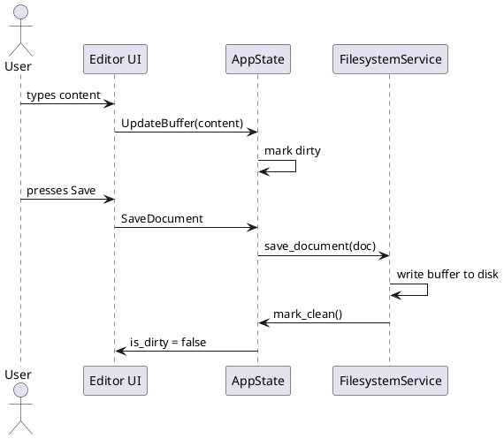

# Document Lifecycle

This document shows the document save flow as a PlantUML sequence diagram.

## Save Flow

```plantuml
@startuml
actor User
participant "Editor UI" as Editor
participant "AppState" as State
participant "FilesystemService" as FS

User -> Editor : types content
Editor -> State : UpdateBuffer(content)
State -> State : mark dirty
User -> Editor : presses Save
Editor -> State : SaveDocument
State -> FS : save_document(doc)
FS -> FS : write buffer to disk
FS -> State : mark_clean()
State -> Editor : is_dirty = false
@enduml
```

The source file on disk is updated **only** when the user explicitly saves.
