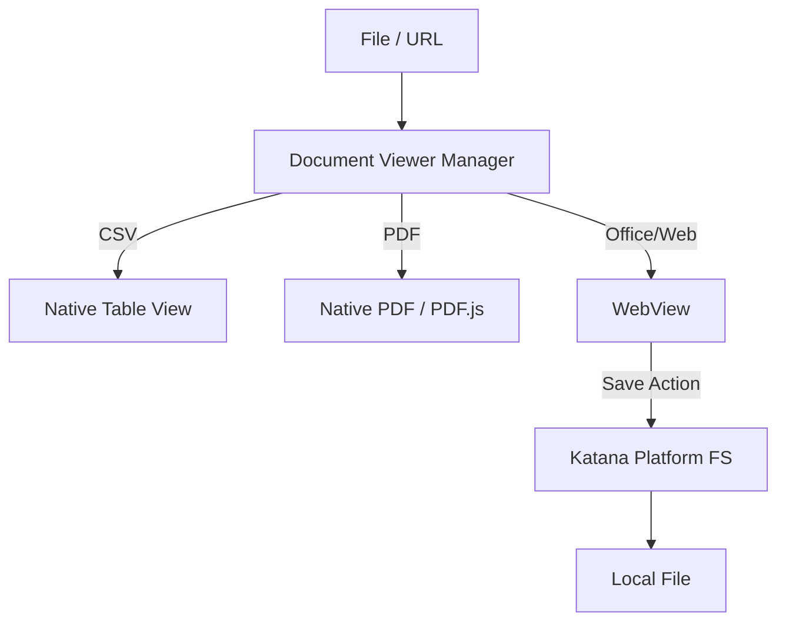

# Design: Document Viewer Integration

## Architecture

ドキュメント閲覧機能を `katana-ui` の独立したビューとして実装する。

### 1. Document Viewer Manager

ファイル拡張子および入力（Path または URL）に基づいて適切なレンダラーを選択する管理モジュール。

- **CSV Renderer**:
    - `egui_extras::Table` を使用。
    - メモリ消費を抑えるため、大規模 CSV の場合はチャンク読み込みを行う。
- **PDF Renderer**:
    - **Option A (Native)**: `pdfium-render` を使用してページをビットマップとしてラスタライズし、`egui` のテクスチャとして表示。
    - **Option B (WebView)**: `pdf.js` を組み込んだ WebView を使用。ズームやテキスト選択などの機能性が高い。
- **Office / Web Viewer (WebView)**:
    - `DOCX`, `XLSX`, `PPTX` および Web URL 用。
    - ローカルの Office ファイルは、一時的な HTML 変換（またはブラウザの標準表示機能）を利用。
    - Web URL はそのまま WebView でロード。

### 2. WebView Component

`egui` のウィンドウ内に外部のブラウザエンジンを統合する。

- **Engine**: `wry` (Rust-native webview library) を採用。
- **Integration Spike**: Task 3 の前に、`egui` と `wry` の描画レイヤー管理、OS ごとのウィンドウハンドル取得、イベント伝播の競合を確認するための技術検証（スパイク）を実施する。
- **Security**: WebView 内でのスクリプト実行は必要最小限に制限し、ローカルファイルシステムへの直接アクセスは `katana-platform` のブリッジ経由のみに限定する。
- **Offline Handling**: ネットワーク未接続時に Web URL を開こうとした場合、WebView の代わりに「オフラインです」というカスタムエラー画面を表示する。

### 3. Web-to-Local Bridge (Saving Function)

Web ドキュメントをローカルに保存するためのフロー。

1. WebView 内で表示されているドキュメントのソース URL または Blob データを取得。
2. `katana-platform` のファイルシステムサービスを介して、ユーザーが指定した場所（保存ダイアログを表示）に保存。
3. **Fallbacks**: 直リンクでのダウンロードが制限されているクラウド文書（Google Docs 等）の場合、PDF への変換出力、または外部ブラウザでのダウンロード指示へフォールバックする。

## UI/UX

- **View Selection**: サイドバーのエクスプローラーでファイルを右クリック -> "Open in Viewer"、または Markdown 内のリンクをクリック。
- **Toolbar**: 拡大/縮小、ページめくり（PDF）、保存（Web）、再読み込みボタン。
- **URL Bar**: Web ドキュメント表示用の URL 入力フィールド。

## Data Flow

## katana-canvas-forge (kcf) との境界

v0.22.11 で `katana-canvas-forge`（kcf）が確立され、KatanA の描画と export 責務は kcf に移管される。本 change との境界を以下に示す。

- **document viewer（本 change）は kcf に依存しない**。PDF viewer は「既存 PDF ファイルを閲覧する」機能であり、kcf の「Markdown から PDF を生成する」export とは別責務。`pdfium-render` / `pdf.js` は viewer 側の renderer として独立して扱う。
- **Markdown from Mermaid / Draw.io の図形**が viewer 経由で表示される場合（Markdown → HTML 出力のプレビューなど）は、描画部分を kcf 経由に揃える。viewer 内で独自 Mermaid 描画を持たない。
- **Office / Web viewer（WebView）** は kcf と無関係。KatanA UI 側の `katana-platform` FS bridge と `wry` に閉じる。
- 本 change で実装する document viewer は v0.26.0（preview crate 分離）後も KatanA UI レイヤーに残る（viewer は egui preview crate とは別ドメイン）。
