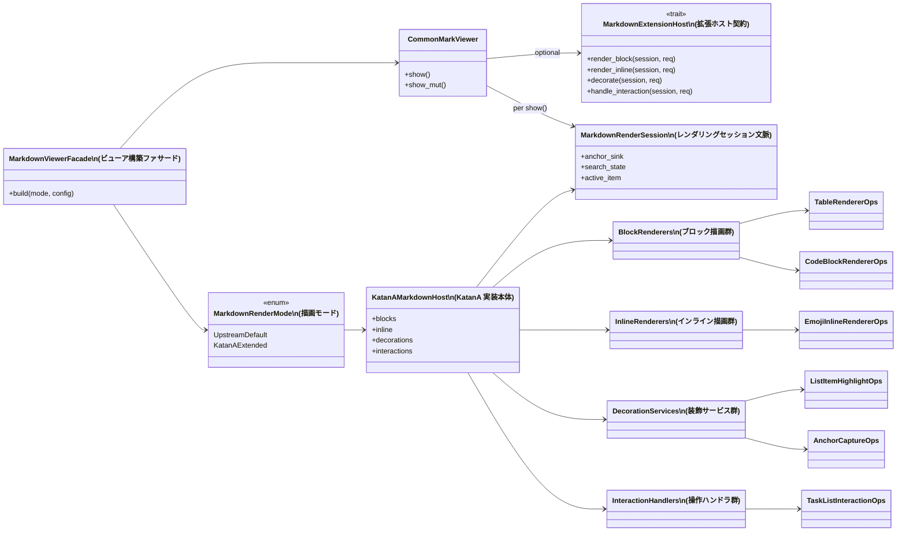

# 設計: KatanA マークダウン vendor 拡張アーキテクチャ

## 背景

### 確認済みの前提

- `vendor/egui_commonmark_upstream/` はすでに subtree として取り込まれている
  - 例: `b4bab77` / `2b319fc8` / `431bee83` / `c62245ec`
- 2026-04-18 時点の upstream 参照先は [lampsitter/egui_commonmark](https://github.com/lampsitter/egui_commonmark/tree/master)
- `master` の先頭は commit `9cc31bd725bc417fc9980375357c18bdf7feee37` (`2026-03-26`, `Release 0.23`)

### 乖離の実測

upstream `master` と現在の subtree を `src/` のみで比較すると、差分は次に集中している。

| 領域 | 差分ファイル | 備考 |
| --- | --- | --- |
| `egui_commonmark/src` | `lib.rs`, `parsers/pulldown.rs`, `ui_components.rs` | ビューア構築処理とパーサに集中 |
| `egui_commonmark_backend/src` | `alerts.rs`, `check.svg`, `copy.svg`, `elements.rs`, `lib.rs`, `misc.rs`, `pulldown.rs` | 画面外観、オプション、解析補助、アセットに集中 |

現在の主要ファイルサイズ:

| ファイル | 行数 |
| --- | ---: |
| `vendor/egui_commonmark_upstream/egui_commonmark/src/parsers/pulldown.rs` | 3,208 |
| `vendor/egui_commonmark_upstream/egui_commonmark/src/lib.rs` | 733 |
| `vendor/egui_commonmark_upstream/egui_commonmark_backend/src/misc.rs` | 738 |
| `vendor/egui_commonmark_upstream/egui_commonmark_backend/src/lib.rs` | 47 |

この差分は subtree の採用そのものに問題があるのではなく、KatanA 固有ロジックの配置が vendor 側へ寄りすぎていることを示している。

### 現状の良い兆候

`render_table_fn` と `crates/katana-ui/src/preview_pane/extension_table.rs` は、vendor 側に最小の差し込み口だけを用意し、実装本体を `katana-ui` 側へ置く方向をすでに示している。本変更ではこの発想をテーブル専用の例外ではなく、Markdown プレビュー全体の設計原則へ格上げする。

## 目的と非目的

### 目的

- vendor の独自差分を明示的なブリッジ層へ閉じ込める
- KatanA 固有の描画、装飾、操作、検索状態管理を `katana-ui` に移す
- `CommonMarkViewer` をコールバックの集積場ではなく、ブリッジ接続点に戻す
- 標準 upstream 描画経路と KatanA 拡張描画経路を実行時に切り替え可能にする
- 実装後の差分を upstream 更新と独立にレビューできる状態を作る

### 非目的

- `pulldown-cmark` event 処理全体を `katana-ui` へ移すこと
- exporter (`katana-core::markdown::render`) を画面プレビューと統合すること
- upstream 全機能をトレイトオブジェクトベースへ全面置換すること

## 設計原則

### 1. vendor の独自差分は 2 種類に限定する

vendor 側に残してよい独自差分は次の 2 種類だけとする。

1. 安定した拡張ブリッジ
2. upstream に返せる汎用修正

subtree 同期そのものは独自差分ではなく、運用手順として別管理する。`katana` という製品固有概念、製品テーマ、コンテキストメニュー、プレビュー固有のホバー / アクティブ状態、製品固有アセットは vendor 側へ置かない。

### 2. 実装本体は `katana-ui` の型付きモジュールに置く

コールバックの無名クロージャを呼び出し元へ散在させず、`katana-ui` のモジュールと構造体に閉じ込める。これにより:

- 厳格な lint を製品コード側へ適用しやすい
- 結合テストの主対象を `katana-ui` に寄せられる
- レンダリング差分を製品コードのレビュー対象として扱える

### 3. 一括置換ではなく二段階移行にする

一気に vendor API を作り変えるのではなく、まず KatanA 側のファサードを先に作る。その後、一度だけ vendor 側のコールバック増殖を単一ブリッジへ畳み込む。

この順序を取る理由:

- 現在の挙動を崩さずに責務整理を先行できる
- `render_table_fn` の先行事例を横展開できる
- ブリッジ導入時の vendor 差分を小さく保てる

### 4. アンカー収集や検索状態は型付きセッション文脈で渡す

アンカー収集先、検索状態、アクティブ項目情報のような描画ごとの拡張状態は、追加コールバックや暗黙のグローバル状態ではなく、ブリッジ契約で定義する型付きセッション文脈にまとめて渡す。これにより `pulldown.rs` に機能別の差し込み口が増殖するのを防ぐ。

## 目標責務分担

| 層 | 所有するもの | 所有してはならないもの |
| --- | --- | --- |
| `vendor/egui_commonmark_upstream/*` | upstream パーサ / 描画、拡張ブリッジ、upstream へ返せる汎用修正 | KatanA 固有ロジック、KatanA テーマ判断、KatanA コンテキストメニュー挙動、製品固有アセット |
| `crates/katana-ui/src/markdown_viewer/*` | KatanA 固有の描画 / 操作 / 装飾、モード切り替え、型付きホスト、型付きセッション文脈 | upstream 同期の仕組み |
| `crates/katana-ui/src/preview_pane/*` | プレビュー固有の呼び出し調停 | コールバック直接合成の詳細 |

## 目標階層

```text
crates/katana-ui/src/markdown_viewer/
  mod.rs
  bridge.rs              # CommonMarkViewer の組み立てとブリッジ接続
  mode.rs                # 標準描画モード / KatanA 拡張描画モードの切り替え
  host.rs                # KatanA 拡張ホストの組み立て入口
  session.rs             # 型付きレンダリングセッション文脈
  types.rs               # 共通要求、フラグ、中間データ構造
  blocks/
    mod.rs
    table.rs             # 現在の extension_table.rs の移設先
    code_block.rs        # コピーボタン、検索強調、アクティブ一致位置
    rich_block.rs        # ブロックアンカー収集、ブロック矩形方針
  inline/
    mod.rs
    emoji.rs             # インライン絵文字の解決
    task_list.rs         # タスクリストのチェック画面要素とコンテキストメニュー
  decorations/
    mod.rs
    list_item_highlight.rs
    search.rs            # 検索装飾とジャンプ状態
    anchors.rs           # アンカー収集と TOC 同期

vendor/egui_commonmark_upstream/egui_commonmark_backend/src/
  extension.rs           # 安定した拡張ホスト契約
  lib.rs                 # 再公開のみ
  misc.rs                # options.extension_host の配線
  pulldown.rs            # 拡張ホストへの最小委譲

vendor/egui_commonmark_upstream/egui_commonmark/src/
  lib.rs                 # CommonMarkViewer と構築側の配線
  parsers/pulldown.rs    # 必要最小限の委譲点
```

### この階層へ移管する既存モジュール

| 現在位置 | 移管先 |
| --- | --- |
| `crates/katana-ui/src/preview_pane/extension_table.rs` | `crates/katana-ui/src/markdown_viewer/blocks/table.rs` |
| `crates/katana-ui/src/widgets/markdown_hooks/*` | `crates/katana-ui/src/markdown_viewer/inline/task_list.rs` |
| プレビュー側の list highlight 配線 | `crates/katana-ui/src/markdown_viewer/decorations/list_item_highlight.rs` |
| プレビュー側の search 配線 | `crates/katana-ui/src/markdown_viewer/decorations/search.rs` |

## クラス図相当



## ブリッジ契約

### 第 1 段階: 既存コールバックのファサード集約

最初の実装段階では、現在すでにある差し込み口をファサードの内側へ集約する。

- `render_table_fn`
- `render_html_fn`
- `render_math_fn`
- `custom_task_box_fn`
- `custom_task_context_menu_fn`
- `custom_emoji_fn`
- `custom_list_item_highlight_fn`

`section_show.rs`、changelog、update modal などの呼び出し側からは直接コールバックを組み立てず、`MarkdownViewerFacade` だけを使うようにする。

### 第 2 段階: 単一拡張ホストへ収束する

KatanA 側ファサードが整ったら、vendor 側のコールバック増殖を `MarkdownExtensionHost` へ収束させる。

ブリッジ契約の原則:

- vendor は `host` を知らないときは upstream の既定経路をそのまま通す
- vendor は意味づけ済みの要求とセッションを渡すだけで、KatanA 実装詳細を知らない
- KatanA 側は `Handled` / `PassThrough` のような応答で処理有無を返す
- 新しい KatanA 機能追加は原則 `katana-ui` 側モジュールの追加だけで完結する

### セッション文脈の扱い

`MarkdownRenderSession` は 1 回の描画呼び出しに紐づく文脈であり、少なくとも次を扱う。

- アンカー収集先
- 検索状態とアクティブ一致情報
- プレビュー側から受け取るアクティブ項目情報

この文脈はブリッジ契約に含め、暗黙の横流し経路や機能別コールバックを増やさない。

## 機能対応表

| 現在の関心事 | 移管先 | 設計判断 |
| --- | --- | --- |
| テーブル描画 | `katana-ui::markdown_viewer::blocks::table` | 既存 `extension_table.rs` を昇格 |
| タスクリストのチェック画面要素 / コンテキストメニュー | `katana-ui::markdown_viewer::inline::task_list` | vendor はイベント委譲のみ |
| インライン絵文字解決 | `katana-ui::markdown_viewer::inline::emoji` | `katana` 命名を vendor から除去 |
| リスト項目のアクティブ / ホバー強調 | `katana-ui::markdown_viewer::decorations::list_item_highlight` | プレビューのローカル状態をモジュール化 |
| 見出し / ブロックアンカー | `katana-ui::markdown_viewer::decorations::anchors` | アンカー収集先は `MarkdownRenderSession` 経由で受け渡す |
| 検索ハイライト / アクティブ一致スクロール | `katana-ui::markdown_viewer::decorations::search` | コードブロックと通常テキストの状態管理を集約 |
| コードブロックのコピーボタン | `katana-ui::markdown_viewer::blocks::code_block` | 製品画面要素と判断し vendor へ残さない |
| alert の余白 / 箇条書き / 番号付け / 汎用引用ブロック | vendor 側の汎用修正レーン | upstream に返せるかを優先判断 |

## 標準描画 / KatanA 拡張描画の切り替え

```text
PreviewPane
  -> MarkdownViewerFacade::build(mode, preview_config)
      -> 標準描画モード: upstream 既定値 + 拡張ホストなし
      -> KatanA 拡張描画モード: 拡張ホスト + katana-ui 側機能モジュール
```

用途:

- upstream 既定挙動との描画差分比較
- デグレ調査時の切り分け
- 将来の vendor 更新時の比較検証

描画モードはコンパイル時フラグではなく、実行時の列挙型で切り替え可能にする。

## vendor 独自差分の許可一覧

実装完了後、vendor 側で許される独自差分は次の許可一覧に限定する。

1. `egui_commonmark_backend/src/extension.rs` の契約定義
2. `egui_commonmark_backend/src/lib.rs` の再公開
3. `egui_commonmark_backend/src/misc.rs` のオプション配線
4. `egui_commonmark/src/lib.rs` の `CommonMarkViewer` / 構築配線
5. `egui_commonmark/src/parsers/pulldown.rs` と `egui_commonmark_backend/src/pulldown.rs` の最小委譲点
6. upstream へ返す予定の汎用修正

補足:

- 汎用アセット修正は upstream へ返せる場合に限り 6 に含める
- `docs/vendor-egui-commonmark.md` や監査スクリプトは vendor 外で管理する

禁止:

- `katana` 文字列を含む製品固有定数 / URI / アセットパス
- vendor 内でのプレビューテーマ / コンテキストメニュー / アプリ固有状態機械の追加
- `CommonMarkViewer` への機能別 field 増殖
- KatanA 専用の画像や装飾アセットの vendor 追加

## 同期戦略

### コミットの層分け

実装は次の層で管理する。

1. subtree 同期コミット
2. ブリッジ層コミット
3. upstream へ返せる汎用修正コミット
4. `katana-ui` 製品実装コミット

### 運用手順書

実装タスク内で `docs/vendor-egui-commonmark.md` を追加し、以下を記す。

- upstream 参照 URL
- 追従対象コミット / タグの確認手順
- 許可一覧ファイル
- 差分監査コマンド
- upstream PR 候補の切り出し方
- 製品固有アセットを vendor に追加しない運用ルール

## 検証戦略

### 製品側テスト

- `katana-ui` の機能モジュールごとに単体テストを追加する
- プレビュー用フィクスチャによる結合テストで描画差分を検証する
- テーブル / タスクリスト / 絵文字 / 検索 / アンカー / コードブロックのフィクスチャを追加する

### vendor 側ガードレール

- vendor 差分監査スクリプトで許可一覧外の変更を検出する
- `make check` を品質ゲートとして通す
- 標準描画モードと KatanA 拡張描画モードの比較テストを持つ

### 画面確認

画面を触るため、少なくとも以下を手動確認またはスクリーンショットで確認する。

- テーブル幅 / ゼブラ表示 / 選択状態
- タスクリストの切り替え / コンテキストメニュー
- 絵文字のベースライン位置
- 検索ジャンプ / アクティブ一致
- ブロックアンカー / TOC 同期

## 設計判断

1. alert spacing や視覚調整のような汎用的な見た目修正は、upstream に返せる見込みがある場合だけ vendor 側の汎用修正として扱う。KatanA に閉じた見た目判断なら `katana-ui` 側へ置く。
2. コードブロックのコピーボタンは KatanA 固有の画面要素とみなし、`katana-ui::markdown_viewer::blocks::code_block` へ移す。
3. アンカー収集は副作用用の横流し経路ではなく、`MarkdownRenderSession` を通じて型付きで扱う。

## リスクと対策

- **リスク:** 単一ホスト導入でライフタイムとトレイトオブジェクトが複雑化する  
  **対策:** 第 1 段階でファサードを先に作り、ブリッジ契約は意味づけ済みの要求 / 応答に限定する

- **リスク:** 汎用修正と KatanA 固有挙動の境界が曖昧になる  
  **対策:** すべての vendor 差分を「ブリッジ」「upstream へ返せる汎用修正」「禁止差分」のいずれかに分類してレビューする

- **リスク:** 既存 WIP と衝突する  
  **対策:** 実装開始の DoR に「vendor に触る WIP の整理」を入れる
